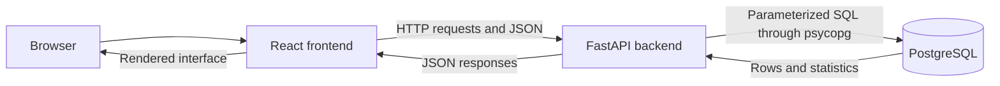

# Teacher Management System
这里添加了一些信息，并且创建了分支，之后在仓库中看看，能不能看到改变
希望能学会git，这样后面学习新项目才更好吗
现在有了gpt老师，真是学习的好机会，
加油加油 小张张
## Project Overview

Teacher Management System is a small full-stack CRUD application built as a
first complete software engineering project. It demonstrates a clear data flow
from a React interface to a FastAPI backend and a PostgreSQL database.

The V1 scope is intentionally small: it manages teacher records, supports basic
search and filtering, and displays a simple staffing dashboard.

## Features

- Create, view, edit, and delete teacher records
- Store teacher data in PostgreSQL
- Search teachers by name or email
- Filter teachers by status and subject
- Combine search and filter conditions
- Validate required fields, email format, status, and duplicate emails
- Display simple success and error messages
- Show total, active, and inactive teacher counts
- Group teacher counts by subject
- Confirm before deleting a teacher

## Tech Stack

- **Frontend:** React 19, Vite, HTML, CSS, JavaScript
- **Backend:** Python, FastAPI, Pydantic
- **Database:** PostgreSQL
- **Database driver:** psycopg 3

No authentication, Docker, Redis, microservices, or external UI framework is
included in V1.

## Architecture



The frontend never connects directly to PostgreSQL. All database operations go
through FastAPI.

## Local Setup

### Prerequisites

- Python 3.9 or later
- Node.js `^20.19.0` or `>=22.12.0`
- PostgreSQL
- A local PostgreSQL database named `teacher_management`

### 1. Configure the backend

From the project root, create and activate a virtual environment:

```powershell
python -m venv .venv
.\.venv\Scripts\Activate.ps1
python -m pip install -r requirements.txt
```

Copy the safe configuration template:

```powershell
Copy-Item .env.example .env
```

Edit `.env` and enter your own PostgreSQL password:

```env
DB_HOST=localhost
DB_PORT=5432
DB_NAME=teacher_management
DB_USER=postgres
DB_PASSWORD=your_real_postgresql_password
FRONTEND_ORIGINS=http://localhost:5173,http://127.0.0.1:5173
```

Prepare the table and sample data:

```powershell
python setup_database.py
```

This setup script is not required every time the application starts.

Start FastAPI:

```powershell
python -m uvicorn main:app --reload
```

- API: <http://127.0.0.1:8000>
- Interactive API docs: <http://127.0.0.1:8000/docs>

### 2. Configure the frontend

Open a second terminal:

```powershell
cd frontend
Copy-Item .env.example .env
npm.cmd install
npm.cmd run dev
```

Open <http://127.0.0.1:5173>.

The frontend environment file contains only the public backend address:

```env
VITE_API_URL=http://127.0.0.1:8000
```

Variables beginning with `VITE_` are visible in browser code. Never place a
database password, API key, or other secret in a frontend environment variable.
Vite reads `VITE_API_URL` when `npm.cmd run build` runs, so a future hosting
platform must provide the deployed backend URL before building the frontend.

## API Overview

| Method | Endpoint | Purpose |
| --- | --- | --- |
| `GET` | `/teachers` | List, search, and filter teachers |
| `POST` | `/teachers` | Create a teacher |
| `PUT` | `/teachers/{id}` | Update a teacher by ID |
| `DELETE` | `/teachers/{id}` | Delete a teacher by ID |
| `GET` | `/dashboard` | Return teacher statistics |

`GET /teachers` accepts these optional query parameters:

- `search`: case-insensitive search in teacher name or email
- `status`: `active` or `inactive`
- `subject`: case-insensitive exact subject filter

Example:

```text
GET /teachers?search=alice&status=active&subject=Mathematics
```

Teacher records contain:

- `id`
- `name`
- `email`
- `subject`
- `status`
- `phone`
- `created_at`

## Environment and Security

- Database credentials are read from the backend `.env` file.
- The real `.env` file is excluded by `.gitignore`.
- `.env.example` files contain placeholders or public local URLs only.
- PostgreSQL queries use parameters instead of inserting user input directly
  into SQL strings.
- Email uniqueness is protected by application checks and a database constraint.

## AI-Assisted Development

AI assistance was used during iterative implementation, debugging, code review,
and documentation. The project scope, local configuration, manual verification,
and final technical decisions were reviewed by the developer. The repository is
kept intentionally small so that its architecture and data flow can be explained
and maintained by the developer.

## Future Improvements

The following are possible next steps and are **not implemented in V1**:

- Deploy the React frontend, FastAPI backend, and managed PostgreSQL database
- Add automated backend and frontend tests
- Add database migrations with a tool such as Alembic
- Add pagination for larger teacher lists
- Add authentication and role-based authorization
- Add continuous integration checks for builds and tests
